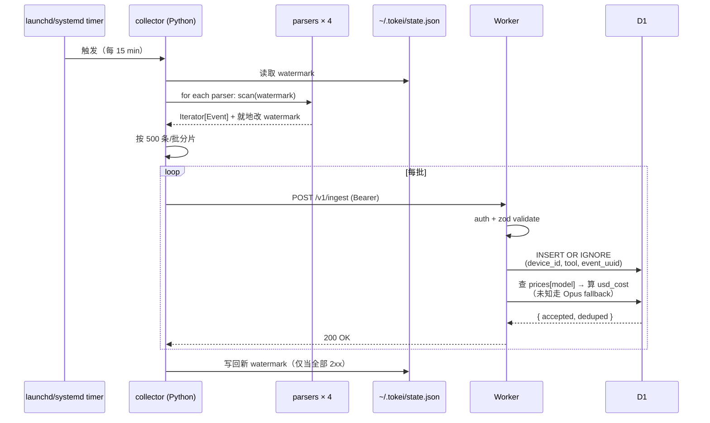
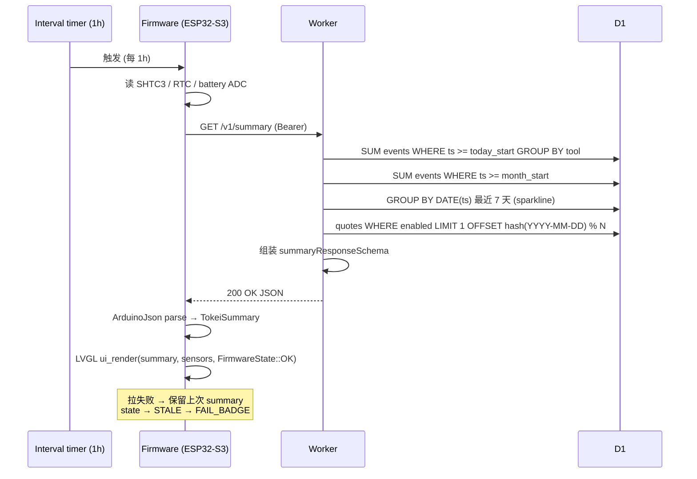
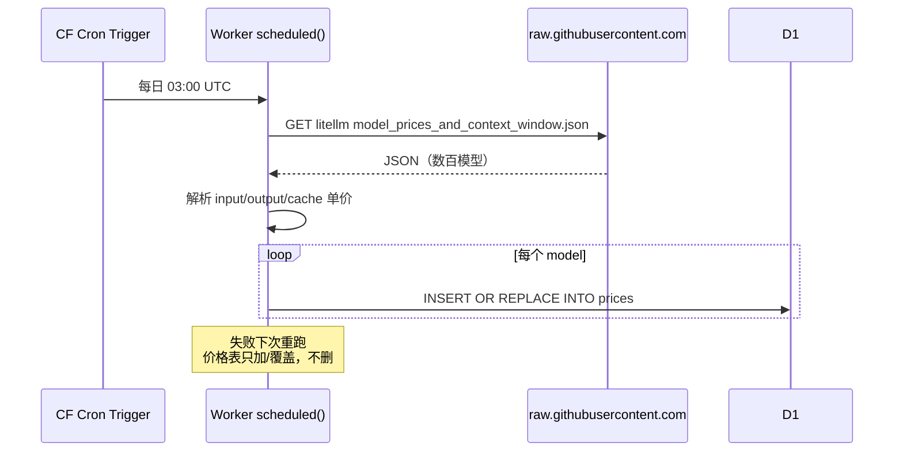

# Tokei · AI Token 用量墨水屏

**Status**: Design · 2026-04-11
**Owner**: chichi
**Codename**: Tokei（日语 "时计"，暗合 token 双关）

---

## 1. Overview

Tokei 是一个 **ambient 信息显示设备**：把跨多个 AI 编程工具（Claude Code / Codex / Cursor / Gemini CLI）的 token 用量汇总到一块桌面上的 4.2" 反射式 LCD（Waveshare ESP32-S3-RLCD-4.2），让使用者**无意识地察觉自己每天烧了多少 token / 多少美元**。

### 1.1 动机

目前每个 AI 工具都有自己的用量 dashboard（Anthropic Console / Cursor Settings / 等等），要了解"今天总共用了多少"需要挨个登录/查询。对于重度用户，这种"多端分散 + 需要主动查询"的状态意味着：

- 成本感知延迟：月末账单才发现花超
- 没有跨工具横向对比
- 没有"趋势"感：哪天用得特别多、哪天特别少不直观

Tokei 用一块**永不休眠、低功耗、paper-like** 的屏把这些数据常驻在桌面，以最低的注意力成本提供"知情权"。

### 1.2 非目标

- ❌ 不做 dashboard Web 界面（MVP）
- ❌ 不做用量告警 / 超额阻断
- ❌ 不支持多用户 / 团队共享
- ❌ 不做历史数据分析工具（只存原始 event 供未来扩展）
- ❌ 不做移动端镜像

---

## 2. 产品用例

### 2.1 主 User Story

> **作为一个多工具并用的 AI 编程用户，我希望桌上始终有一块屏显示今日/本月跨工具 token 总量、细分、趋势和金额，这样我可以在不切换上下文的情况下感知 AI 使用量的脉搏。**

### 2.2 功能用例矩阵

| # | User Story | 产品层行为 | 影响范围 |
|---|---|---|---|
| UC-1 | 今日总 token 一眼可见 | 屏幕正中大号数字 + 单位 | UI / Worker 聚合 |
| UC-2 | 按工具分行查看 | 右侧列表：Claude Code / Cursor（主力），未来可扩到 4 个 | UI / Worker 聚合 |
| UC-3 | 美元成本随 token 显示 | hero 区下方副号："$4.72 · 月 17.2M · $77.80" | Worker 换算 |
| UC-4 | 近 7 天趋势 | hero 下 micro-sparkline 7 根柱 | Worker 聚合 |
| UC-5 | 每日金句陪伴 | 底部 quote footer，4 大类（计算机/唐诗/科幻/哲学）每日一换 | Worker quotes 表 |
| UC-6 | 状态栏常驻信息 | 日期/时间/温度/湿度/Wi-Fi/电量一行 | Firmware 读本地传感器 |
| UC-7 | Sync 失败肉眼可辨 | 反色 badge `SYNC FAIL · Xh OLD` 替换正常的 "SYNC Xm AGO" | Firmware 错误状态机 |
| UC-8 | WiFi 掉线明确提示 | 状态栏 WiFi 点空心 + hero 区 `NO WIFI · Xm OLD` badge | Firmware |
| UC-9 | 新设备接入简单 | `tokei-collect --init` 一条命令生成配置 | Collector CLI |
| UC-10 | 历史数据不丢 | 首次运行自动 backfill 本地所有历史日志 | Collector + Worker 幂等 |

### 2.3 成功标准

- 屏上数字与各工具自己 UI 里的今日 token 总量误差 < 1%
- Collector 7×24 跑一周无人工介入，数据无丢失无重复
- Sync 异常发生后 ≤ 2 个周期（2h）内屏上出现 error badge
- 电源拔插 → 自动恢复到稳定状态

---

## 3. 技术架构

### 3.1 三层单向数据流

```
┌────────────────────────┐
│ LAYER 1 · DEVICES (N=4)│
│ 2 Mac + 2 Linux        │
│ Python collector binary│
│ launchd / systemd timer│
│ every 15 min           │
└───────────┬────────────┘
            │ HTTPS POST /v1/ingest
            │ Bearer token
            │ JSON events[]
            ▼
┌────────────────────────┐
│ LAYER 2 · CLOUDFLARE   │
│ Worker (TypeScript)    │
│ + D1 (SQLite)          │
│ + Cron Trigger (daily) │
│ events / prices / quotes
└───────────┬────────────┘
            │ HTTPS GET /v1/summary
            │ Bearer token
            │ JSON summary
            ▼
┌────────────────────────┐
│ LAYER 3 · ESP32-S3     │
│ RLCD 4.2" (ST7305)     │
│ Arduino + LVGL         │
│ every 1h pull          │
└────────────────────────┘
```

### 3.2 边界原则

- **collector 不懂聚合**：只负责"把新 event 送到 worker"，从不计算今日/月总
- **worker 不懂界面**：只负责"把 event 聚合成 summary"，从不关心屏如何布局
- **firmware 不懂价格**：只负责"把 summary 画出来"，从不做数学换算
- **单向数据流**：设备 → worker → 屏。无反向推送，无 WebSocket，无 push notification

### 3.3 技术栈选型

| 组件 | 语言 | 关键依赖 |
|---|---|---|
| Collector | Python 3.11+ | `uv` 管理 · `ruff` lint · `pyright` strict · `httpx` · stdlib `sqlite3` |
| Worker | TypeScript | `pnpm` · `oxlint` · `oxfmt`（遇阻回退 Prettier）· `tsc` strict · `@orpc/contract` · `@orpc/server` · `drizzle-orm` · `drizzle-kit` · `zod` |
| Firmware | C++ (Arduino) | `PlatformIO` · LVGL v9 · ArduinoJson · HTTPClient · WiFiManager · 卖家 ST7305 驱动（vendored from `waveshareteam/ESP32-S3-RLCD-4.2` 的 `02_Example/Arduino/09_LVGL_V9_Test`） |
| DB | Cloudflare D1 (SQLite) | Drizzle schema + drizzle-kit migrations |
| 价格源 | LiteLLM 社区表 | `raw.githubusercontent.com/BerriAI/litellm/main/model_prices_and_context_window.json` |

### 3.4 Monorepo 结构

```
tokei/
├── README.md
├── .gitignore
├── .github/workflows/ci.yml
├── fixtures/                         # 跨层契约 fixture
│   ├── events/
│   └── summaries/
├── collector/                        # Python · uv · src layout
│   ├── pyproject.toml
│   ├── src/tokei_collector/
│   │   ├── __main__.py
│   │   ├── config.py
│   │   ├── state.py
│   │   ├── uploader.py
│   │   ├── models.py
│   │   └── parsers/
│   │       ├── base.py
│   │       ├── claude_code.py
│   │       ├── codex.py
│   │       ├── cursor.py
│   │       └── gemini.py
│   ├── tests/
│   └── deploy/
│       ├── com.tokei.collector.plist
│       ├── tokei-collector.timer
│       └── tokei-collector.service
├── worker/                           # TypeScript · pnpm
│   ├── package.json
│   ├── pnpm-lock.yaml
│   ├── tsconfig.json
│   ├── wrangler.toml
│   ├── drizzle.config.ts
│   ├── src/
│   │   ├── index.ts
│   │   ├── router.ts
│   │   ├── contract/
│   │   │   ├── index.ts
│   │   │   ├── ingest.ts
│   │   │   └── summary.ts
│   │   ├── routes/
│   │   │   ├── ingest.ts
│   │   │   └── summary.ts
│   │   ├── middleware/
│   │   │   ├── auth.ts
│   │   │   ├── errorHandler.ts
│   │   │   └── metrics.ts
│   │   ├── db/
│   │   │   ├── schema.ts
│   │   │   ├── events.ts
│   │   │   ├── aggregate.ts
│   │   │   ├── prices.ts
│   │   │   └── quotes.ts
│   │   └── cron/
│   │       └── fetchPrices.ts
│   ├── migrations/
│   └── test/
└── firmware/                         # Arduino + LVGL + PlatformIO
    ├── platformio.ini
    ├── src/
    │   ├── main.cpp
    │   ├── network.cpp
    │   ├── api.cpp
    │   ├── ui.cpp
    │   └── sensors.cpp
    ├── include/
    │   └── config.h                  # gitignored，包含 wifi / token
    ├── lib/
    │   └── (vendored ST7305 driver + BSP)
    ├── fonts/
    │   ├── helvetica_bold_60.c
    │   ├── helvetica_bold_20.c
    │   └── noto_sans_cjk_14.c
    └── README.md
```

---

## 4. 组件细节

### 4.1 Collector（Python）

#### 4.1.1 职责

- 按 timer 周期（default 15 min）从本地日志源读取新 event
- 去重幂等依靠 worker 侧 `INSERT OR IGNORE`，collector 自己只维护 watermark
- 批量（500 条/批）POST 到 worker `/v1/ingest`
- 成功后前进 watermark；失败保留老 watermark 下次重试
- 首次运行 = backfill（state.json 为空 → 全量扫）

#### 4.1.2 Parser 契约

```python
from typing import Protocol, Iterator
from .models import Event

class Parser(Protocol):
    tool_name: str  # "claude_code" | "codex" | "cursor" | "gemini"

    def scan(self, watermark: dict) -> Iterator[Event]:
        """扫描本地日志源，yield 新 event，就地修改 watermark。

        watermark 结构由 parser 自定义（dict），uploader 不关心其内部。
        成功 POST 后由 main 保存整个 state.json。
        """
        ...
```

#### 4.1.3 Event 模型

```python
from dataclasses import dataclass, field

@dataclass(frozen=True)
class Event:
    tool: str                       # "claude_code" | "codex" | "cursor" | "gemini"
    event_uuid: str                 # idempotency key，parser 负责稳定生成
    ts: int                         # unix seconds
    model: str | None               # 模型名称；未知时 None（worker 走 Opus fallback）
    input_tokens: int
    output_tokens: int
    cached_input_tokens: int = 0
    cache_creation_tokens: int = 0
    reasoning_output_tokens: int = 0
```

#### 4.1.4 各 parser 数据源（调研结果）

| Parser | 数据位置 | 提取方式 | event_uuid 来源 |
|---|---|---|---|
| `claude_code` | `~/.claude/projects/<proj>/<session>.jsonl` | 遍历 JSONL，每行 `message.usage.*` + `message.model` | 每行的 `uuid` 字段 |
| `codex` | `~/.codex/sessions/YYYY/MM/DD/rollout-*.jsonl` | 取每个 rollout 的最后一条 `event_msg` with `type=token_count`，读 `info.total_token_usage`（session 累计值） | `<session_id>#final` |
| `cursor` | `~/Library/Application Support/Cursor/User/globalStorage/state.vscdb` + workspaceStorage/*/state.vscdb | sqlite3 查 `cursorDiskKV WHERE key LIKE 'bubbleId:%'`，`json_extract` 出 `tokenCount.inputTokens` / `.outputTokens` / `usageUuid` / `timingInfo.clientEndTime` | `usageUuid` 字段 |
| `gemini` | 用户配置的 `~/.gemini/settings.json` 里 `telemetry.outfile` 指定的 OTLP log 文件 | 读 OTLP JSONL，抽 `input_token_count` / `output_token_count` / `cached_content_token_count` / `thoughts_token_count` / `tool_token_count` | event id + timestamp 哈希 |

**注意事项**：
- **Gemini 需要一次性 setup**：用户需要在 `~/.gemini/settings.json` 里开启 telemetry：
  ```json
  { "telemetry": { "enabled": true, "target": "local", "outfile": "~/.gemini/telemetry.log" } }
  ```
  collector 首次运行时检测 `telemetry.outfile`，缺失则 print setup 提示
- **Cursor model 字段**：bubble blob 里未必有显式 model 字段。首版实现先不填 `model`（让 worker 走 Opus fallback 定价）。后续可以从兄弟 key `messageRequestContext:*` 或 `composerData:*` 里查找。

#### 4.1.5 CLI 接口

```
tokei-collect                    # 默认：一次扫描 + 上传（供 timer 调用）
tokei-collect --init             # 交互式生成 ~/.tokei/config.toml
tokei-collect --backfill         # 等同于清空 state.json 后一次扫描
tokei-collect doctor             # 显示各 parser last_success_ts / last_error / watermark 摘要
tokei-collect install --launchd  # 生成并安装 launchd plist（Mac）
tokei-collect install --systemd  # 生成并安装 systemd timer（Linux）
```

#### 4.1.6 配置文件

`~/.tokei/config.toml`:

```toml
device_id = "chichi-mbp"           # unique per device
worker_url = "https://tokei-worker.<subdomain>.workers.dev"
bearer_token = "env:TOKEI_TOKEN"   # 支持 env 引用避免硬编码

[parsers]
enabled = ["claude_code", "codex", "cursor", "gemini"]

[parsers.gemini]
outfile = "~/.gemini/telemetry.log"
```

### 4.2 Worker（TypeScript）

#### 4.2.1 职责

- 实现两个 oRPC 路由：`POST /v1/ingest`、`GET /v1/summary`
- 实现一个 cron trigger：每日拉 LiteLLM 价格表写入 `prices` 表
- 中间件：bearer auth、错误处理
- D1 是唯一数据源，无额外缓存层

#### 4.2.2 oRPC Contract

参照 pixai 的 contract-first 模式：一个 `tokeiContract` router 包含所有 procedure，contract 和 handler 分离，middleware 在外层 compose。

```typescript
// worker/src/contract/index.ts
import { oc } from '@orpc/contract'
import { implement } from '@orpc/server'
import { z } from 'zod'

const toolEnum = z.enum(['claude_code', 'codex', 'cursor', 'gemini'])

export const eventSchema = z.object({
  tool: toolEnum,
  event_uuid: z.string().min(1).max(128),
  ts: z.number().int(),
  model: z.string().nullable(),
  input_tokens: z.number().int().nonnegative(),
  output_tokens: z.number().int().nonnegative(),
  cached_input_tokens: z.number().int().nonnegative().default(0),
  cache_creation_tokens: z.number().int().nonnegative().default(0),
  reasoning_output_tokens: z.number().int().nonnegative().default(0),
})

export const summaryResponseSchema = z.object({
  today: z.object({
    total_tokens: z.number().int(),
    total_usd: z.number(),
    tools: z.array(z.object({
      name: toolEnum,
      tokens: z.number().int(),
      usd: z.number(),
    })),
  }),
  month: z.object({
    total_tokens: z.number().int(),
    total_usd: z.number(),
  }),
  sparkline_7d: z.array(z.number().int()).length(7),  // k tokens/day, 升序
  quote: z.object({
    text: z.string(),
    attr: z.string(),
    category: z.enum(['computing', 'poetry-tang', 'scifi', 'philosophy']),
    lang: z.enum(['en', 'zh']),
  }),
  sync_ts: z.number().int(),
  fallback_priced_tokens: z.number().int().default(0),
})

export const tokeiContract = oc
  .prefix('/v1')
  .tag('Tokei')
  .router({
    ingest: oc
      .route({ method: 'POST', path: '/ingest' })
      .input(z.object({
        device_id: z.string().min(1).max(64),
        events: z.array(eventSchema).min(1).max(500),
      }))
      .output(z.object({
        accepted: z.number().int().nonnegative(),
        deduped: z.number().int().nonnegative(),
      }))
      .errors({
        UNAUTHORIZED: { status: 401, message: 'Missing or invalid bearer token' },
        CLOCK_SKEW:   { status: 422, message: 'Event timestamp skewed > 1 day from server time' },
      }),

    summary: oc
      .route({ method: 'GET', path: '/summary' })
      .output(summaryResponseSchema)
      .errors({
        UNAUTHORIZED: { status: 401, message: 'Missing or invalid bearer token' },
      }),
  })

// handler builder typed against the contract
export const os = implement(tokeiContract)
```

#### 4.2.3 Handler 实现与 Router 组装

```typescript
// worker/src/routes/ingest.ts
import { os } from '../contract'

export const ingest = os.ingest.handler(async ({ input, context }) => {
  // 1. validate ts 偏差；2. batch INSERT OR IGNORE；3. 查价格计算 usd_cost
  // 4. 返回 { accepted, deduped }
})
```

```typescript
// worker/src/routes/summary.ts
import { os } from '../contract'

export const summary = os.summary.handler(async ({ context }) => {
  // 1. 今日/月聚合查询；2. 7 天 sparkline；3. 选取 quote；4. 组装响应
})
```

```typescript
// worker/src/router.ts
import { os } from './contract'
import { ingest } from './routes/ingest'
import { summary } from './routes/summary'
import { authMiddleware } from './middleware/auth'
import { errorHandler } from './middleware/errorHandler'

export const tokeiRouter = os
  .$context<{ db: D1Database; env: Env }>()
  .use(errorHandler)
  .use(authMiddleware)
  .router({ ingest, summary })
```

### 4.3 Firmware（Arduino + LVGL）

#### 4.3.1 屏幕布局（400×300 纯黑白，分 4 个区域）

垂直自上而下：

| 区域 | 高度 | 内容 |
|---|---|---|
| **Status bar** | 24 px | 左：反色 `TOKEI` brand。中：`WED · 04-11 · 14:23`。右：`22.4°C · 48% · WiFi · BAT 87%` |
| **Hero 左半 + 右工具列表** | 174 px | 左边 158 px 宽：`TODAY` 标签 / 今日总 token 大号数字 / `$USD` 副号 / 月总小字 / 7 天 sparkline。右边余下宽度：工具列表（每行一个 tool，自适应 flex 均分）|
| **Quote footer** | 102 px | 斜纹 texture 背景 + `DAILY · <category>` 小字 + 居中斜体 quote 正文 + 右对齐 attribution |

工具列表行数随 `tools.length` 自适应：2 行时每行 ~87 px 带月总 subtitle，3-4 行时每行 ~43 px 砍掉 subtitle，5+ 行时缩小字号或合并 OTHERS（MVP 不实现，只预留）。

错误状态下，hero 区右上角的 `SYNC Xm AGO` 小字被替换为反色 badge（见 § 7.3）。

#### 4.3.2 职责

- 启动阶段连 WiFi（WiFiManager，支持首次 AP 配网）+ NTP 对时
- 每 1h 发 `GET /v1/summary`，解析 JSON 存 TokeiSummary struct
- LVGL 布局从 struct 渲染，工具行数自适应
- 板载传感器（SHTC3 / PCF85063 RTC / battery ADC）独立读取填 status bar
- 错误状态机（见 § 7.3）

#### 4.3.3 核心结构

```cpp
// firmware/src/api.cpp
struct ToolEntry {
  char name[32];
  int64_t today_tokens;
  int64_t month_tokens;
  float today_usd;
  float month_usd;
};

struct TokeiSummary {
  int64_t today_total_tokens;
  float today_total_usd;
  int64_t month_total_tokens;
  float month_total_usd;
  int sparkline_7d[7];              // k tokens/day
  ToolEntry tools[6];               // max 6
  uint8_t tool_count;
  char quote_text[256];
  char quote_attr[64];
  char quote_category[32];
  time_t sync_ts;
  int64_t fallback_priced_tokens;
  bool valid;                       // false 表示首次启动未拉到数据
};
```

#### 4.3.4 渲染入口

```cpp
// firmware/src/ui.cpp
void ui_render(const TokeiSummary& s, const SensorReading& sensors, FirmwareState state);
```

`FirmwareState` 决定是正常渲染还是错误状态屏：

```cpp
enum class FirmwareState {
  OK,                    // 正常渲染
  STALE,                 // 显示旧数据 + 正常 SYNC 标签（1 次失败宽容）
  FAIL_BADGE,            // SYNC FAIL · Xh OLD
  WIFI_OFF,              // NO WIFI · Xm OLD + 空心 WiFi 点
  FIRST_SYNC_PENDING,    // 冷启动等待屏
};
```

### 4.4 D1 Schema（Drizzle）

```typescript
// worker/src/db/schema.ts
import { sqliteTable, text, integer, real, primaryKey, index } from 'drizzle-orm/sqlite-core'

export const events = sqliteTable('events', {
  deviceId: text('device_id').notNull(),
  tool: text('tool', { enum: ['claude_code', 'codex', 'cursor', 'gemini'] }).notNull(),
  eventUuid: text('event_uuid').notNull(),
  ts: integer('ts').notNull(),                          // unix seconds
  model: text('model'),
  inputTokens: integer('input_tokens').notNull().default(0),
  cachedInputTokens: integer('cached_input_tokens').notNull().default(0),
  outputTokens: integer('output_tokens').notNull().default(0),
  cacheCreationTokens: integer('cache_creation_tokens').notNull().default(0),
  reasoningOutputTokens: integer('reasoning_output_tokens').notNull().default(0),
  usdCost: real('usd_cost'),                            // 入库快照，价格变动不回溯
  usedFallbackPrice: integer('used_fallback_price', { mode: 'boolean' }).notNull().default(false),
}, (t) => ({
  pk: primaryKey({ columns: [t.deviceId, t.tool, t.eventUuid] }),
  tsToolIdx: index('idx_events_ts_tool').on(t.ts, t.tool),
}))

export const prices = sqliteTable('prices', {
  model: text('model').primaryKey(),
  inputCostPerToken: real('input_cost_per_token').notNull(),
  outputCostPerToken: real('output_cost_per_token').notNull(),
  cacheReadInputTokenCost: real('cache_read_input_token_cost'),
  cacheCreationInputTokenCost: real('cache_creation_input_token_cost'),
  updatedAt: integer('updated_at').notNull(),
})

export const quotes = sqliteTable('quotes', {
  id: integer('id').primaryKey({ autoIncrement: true }),
  text: text('text').notNull(),
  attr: text('attr'),
  category: text('category', { enum: ['computing', 'poetry-tang', 'scifi', 'philosophy'] }).notNull(),
  lang: text('lang', { enum: ['en', 'zh'] }).notNull().default('en'),
  enabled: integer('enabled', { mode: 'boolean' }).notNull().default(true),
})
```

---

## 5. 技术流程

### 5.1 Ingest Flow（collector → worker）



### 5.2 Summary Flow（firmware → worker）



### 5.3 Price Sync Flow（cron）



---

## 6. 接口和数据模型

### 6.1 POST /v1/ingest

**Request**
```json
{
  "device_id": "chichi-mbp",
  "events": [
    {
      "tool": "claude_code",
      "event_uuid": "019b74c1-e87e-7ef2-91b3-f18518d58cce-msg-42",
      "ts": 1744370123,
      "model": "claude-sonnet-4-5",
      "input_tokens": 8421,
      "cached_input_tokens": 5200,
      "output_tokens": 342,
      "cache_creation_tokens": 0,
      "reasoning_output_tokens": 0
    }
  ]
}
```

**Response 200**
```json
{ "accepted": 12, "deduped": 3 }
```

**Behaviors**
- `accepted` = 实际插入 D1 的新行数
- `deduped` = 因主键冲突被 `INSERT OR IGNORE` 的行数
- 单请求最多 500 event（zod 校验 + 422）
- Bearer token 失败 → 401 UNAUTHORIZED
- `|server_now - event.ts| > 86400` → 422 CLOCK_SKEW（整批拒绝，collector 提示用户校时钟）
- 未知 model：`usd_cost` 计算时 fallback 到 **`claude-opus-4-6`**（LiteLLM 表里当代 Opus 的标准 key，$5/M input + $25/M output）。`used_fallback_price = true` 标记该行走了 fallback

### 6.2 GET /v1/summary

**Response 200**
```json
{
  "today": {
    "total_tokens": 1160000,
    "total_usd": 4.72,
    "tools": [
      { "name": "claude_code", "tokens": 847000, "usd": 3.40 },
      { "name": "cursor",      "tokens": 312000, "usd": 1.32 }
    ]
  },
  "month": { "total_tokens": 17200000, "total_usd": 77.80 },
  "sparkline_7d": [850, 1100, 620, 1400, 980, 1500, 1160],
  "quote": {
    "text": "Premature optimization is the root of all evil.",
    "attr": "Donald Knuth",
    "category": "computing",
    "lang": "en"
  },
  "sync_ts": 1744370400,
  "fallback_priced_tokens": 0
}
```

**Behaviors**
- `today` / `month` 边界：**设备本地时区**。MVP 阶段 worker 里 hardcode `Asia/Shanghai` (UTC+8)。后续若跨时区再考虑从设备传 `tz` 参数
- `sparkline_7d`：按日期升序（最老到最新），单位 k tokens（/1000 后四舍五入），空的日子补 0
- `tools`：按 today tokens 降序
- `quote` 选取：`id = quotes[hash('2026-04-11') % count(quotes WHERE enabled)]`
- `sync_ts` = worker 响应生成时刻（用于屏显示 "SYNC Xm AGO"）

### 6.3 字段写入时机表

| 表 | 字段 | 写入时机 | 更新时机 |
|---|---|---|---|
| events | `usd_cost` | `/ingest` 插入时用当时的 prices 表算 | **不更新**，价格变动不回溯 |
| events | `used_fallback_price` | 同上，若走 Opus fallback 则 true | 不更新 |
| prices | 全部 | cron 日拉 LiteLLM 时 INSERT OR REPLACE | 同上 |
| quotes | 全部 | migration / 手动 seed / 手动添加 | 手动 toggle `enabled` |

---

## 7. 错误处理 & 可观测性

### 7.1 Collector

| 故障 | 检测 | 恢复 | 可见性 |
|---|---|---|---|
| Parser 抛异常 | `try/except` 包 `scan()` | 跳过该 parser 本轮，其他 3 个继续；watermark 不前进 | `~/.tokei/error.log` + `doctor` |
| 网络失败 / 5xx | httpx 异常 | 指数退避重试 1s/2s/4s/8s 共 4 次；全败则本轮放弃 | 同上 |
| 4xx 响应 | HTTP status | 不重试，记日志并前进 watermark（避免死循环） | `doctor` 高亮 |
| State 文件损坏 | JSON parse 失败 | fallback 全量扫，写备份 `.state.json.bak.<ts>` | stderr warning |
| 时钟偏差 | 收到 422 CLOCK_SKEW | 打印校时提示，丢弃本批 | `doctor` 显示 |

### 7.2 Worker

| 故障 | 检测 | 恢复 | 可见性 |
|---|---|---|---|
| Auth 失败 | auth middleware | 401 | CF Logs |
| Input schema 不合法 | zod | 400 + 错误结构 | CF Logs |
| D1 写入失败 | try/catch | 500，collector 会重试 | `console.error` → CF Logs |
| 未知 model 价格 | `prices[model]` 返回空 | fallback `claude-opus-4-6` 定价 + `used_fallback_price=true` | summary 的 `fallback_priced_tokens` 字段 |
| Cron 价格拉取失败 | fetch 异常 | 跳过，24h 后重试；旧价格继续用 | CF Logs |

### 7.3 Firmware 错误状态机

```
State: OK
  ↓ (summary fetch fails)
State: STALE             (显示旧数据，正常 SYNC 标签，一次宽容)
  ↓ (2nd consecutive fail)
State: FAIL_BADGE        (显示反色 "SYNC FAIL · Xh OLD" badge)
  ↓ (WiFi disconnect)
State: WIFI_OFF          (显示 "NO WIFI · Xm OLD" badge + 空心 WiFi 点)
Any success → OK
Cold boot without cache → FIRST_SYNC_PENDING
```

**屏幕错误状态**：

| 状态 | 视觉 |
|---|---|
| OK | status bar 正常 / hero 右上 "SYNC 2m AGO" |
| STALE | 同 OK，只是时间戳变老 |
| FAIL_BADGE | hero 右上变成黑底白字 `! SYNC FAIL · 2h OLD` |
| WIFI_OFF | status bar WiFi 点空心 + hero 右上 `! NO WIFI · 12m OLD` |
| FIRST_SYNC_PENDING | 整屏退回 "WAITING FOR FIRST SYNC" 等待画面 |

### 7.4 跨层可观测性

- **Collector**：`~/.tokei/error.log`（轮转 7 天）+ `tokei-collect doctor` CLI
- **Worker**：`console.log` → CF Workers Logs（免费档）+ `GET /v1/health` endpoint 返回 `{ last_ingest_per_device, last_summary_served, db_ok }`（MVP 可选）
- **Firmware**：串口调试（开发阶段）；生产运行靠屏上 "SYNC X min ago" 和错误 badge 自然暴露
- **End-to-end 健康检查**：手动 `curl /v1/health` + 远程 ssh 跑 `tokei-collect doctor`

---

## 8. 测试计划

### 8.1 业务用例 × 验证方式

| UC | 验证行为 | 测试类型 | 工具 |
|---|---|---|---|
| UC-1 | 今日总量正确 | Unit + E2E | pytest / vitest / curl 真屏 |
| UC-2 | 按工具分行聚合正确 | Unit | vitest + miniflare D1 |
| UC-3 | 美元成本换算正确 | Unit | vitest |
| UC-4 | 7 日 sparkline 正确 | Unit | vitest |
| UC-5 | 金句每日稳定、跨日轮换 | Unit + property test | vitest + fast-check |
| UC-6 | 状态栏传感器读数正确 | Manual | 真屏 + SHTC3 哈气 |
| UC-7 | Sync 失败 badge 出现 | Manual | 断 worker 等 2 cycles |
| UC-8 | WiFi 掉线视觉状态 | Manual | 拔 AP |
| UC-9 | 新设备 init 流程 | Manual | 真机 |
| UC-10 | Backfill + 幂等重放 | Integration | pytest + miniflare |
| *    | 重复 event 不双计 | Unit | vitest |
| *    | 跨 4 device 聚合 | Integration | vitest + fixture |
| *    | 未知 model Opus fallback | Unit | vitest |
| *    | 价格变动不回溯 | Unit | vitest |
| *    | Parser 挂一个不拖累其他 | Unit | pytest |

### 8.2 契约 fixtures（monorepo 根）

```
fixtures/
├── events/
│   ├── claude_code_basic.json
│   ├── codex_with_reasoning.json
│   ├── cursor_with_usage_uuid.json
│   ├── gemini_otlp_shape.json
│   └── unknown_model.json               # 触发 Opus fallback
└── summaries/
    ├── happy_path.json
    ├── with_fallback_priced.json
    └── first_sync_empty.json
```

双向消费：Python `test_contract.py` + TS `contract.test.ts` 都读同一份文件，保证两端 schema 不漂移。

### 8.3 不做的测试

- ❌ 负载压测（4 × 1 req/15min = 微不足道）
- ❌ 安全渗透（bearer + HTTPS 对个人项目足够）
- ❌ 多硬件兼容（固定一块板）
- ❌ 固件自动化测试（纯视觉 + 硬件交互，mock 没意义）

### 8.4 CI

`.github/workflows/ci.yml`：3 个并行 job

- `collector-py`: `uv sync` → `ruff check` → `pyright` → `pytest`
- `worker-ts`: `pnpm install` → `oxlint` → `tsc --noEmit` → `vitest` → `wrangler deploy --dry-run`
- `firmware-cpp`: `pio check`（静态分析，不 flash）

部署手动触发：
- Worker：`pnpm --filter worker deploy`
- Collector：`pipx install git+https://github.com/<user>/tokei#subdirectory=collector`
- Firmware：`pio run -t upload`（USB 连板子）

---

## 9. 容量与成本

### 9.1 流量估算

| 指标 | 计算 | 值 |
|---|---|---|
| Collector 上报频率 | 4 设备 × 每 15 min × 24h | 384 req/day |
| 屏拉取频率 | 1 屏 × 每 1h | 24 req/day |
| Worker 总 req/day | 384 + 24 + 1 cron | ~410 req/day |
| Event 流量（重度估算） | 4 设备 × 500 event/day | 2000 event/day |
| 年 event 总量 | 2000 × 365 | ~730k event/year |
| 每 event 字节 | D1 single row ≈ 150 bytes | |
| 年存储 | 730k × 150 B | ~110 MB/year |

### 9.2 Cloudflare 免费档

| 资源 | 免费限额 | Tokei 使用 | 余量 |
|---|---|---|---|
| Worker req | 100k/day | ~410/day | **0.4%** |
| D1 reads | 5M/day | <1k/day | 几乎 0 |
| D1 writes | 100k/day | ~2k/day | 2% |
| D1 storage | 5 GB | <200 MB（3 年） | 充足 |
| Cron triggers | 免费 | 1/day | 充足 |

结论：**永远在免费档**。

### 9.3 固件功耗

- 插电模式 USB-C 5V，不考虑电池（电池做断电保底）
- 反射 LCD 无背光，功耗以 ESP32-S3 CPU + WiFi 为主
- 每 1h 醒来 ~5 秒拉数据 + 渲染 → light sleep，平均 < 50 mA
- 长期插电无需优化

---

## 10. 待确认 / 未解决问题

以下项目留到实现阶段 resolve，**不阻塞**本 spec 定稿：

1. ~~**`claude-opus-4-6` 的 LiteLLM key 精确名**~~ **已解决**：bare key `claude-opus-4-6` 存在于 LiteLLM 表，prices 为 `input_cost_per_token = 5e-06`, `output_cost_per_token = 2.5e-05`。直接硬编码即可。
2. **Cursor model 字段**：首版 parser 先不填 model（交给 Opus fallback）。后续可从 `messageRequestContext:*` / `composerData:*` 兄弟 key 挖掘。
3. **今日/月时区边界**：MVP hardcode UTC+8 (Asia/Shanghai)。将来如果跨时区用户，改成设备侧传 `tz` 参数或 worker 从 request header 读 geolocation。
4. **Quote seed 初始列表**：需要产出 4 大类各 20 条共 80 条的初始 seed（作为 `0002_seed_quotes.sql` migration）。放到 implementation plan 里作为独立任务。
5. **oxfmt 成熟度**：若 `oxc-formatter` 在开发阶段不稳定，回退 Prettier 作为 formatter。
6. **OTA 机制**：MVP 用 USB flash；未来加 ArduinoOTA。
7. **Health endpoint**：`GET /v1/health` 是否 MVP 内就做？倾向**做**，因为手动排查时非常有用，实现成本也低。

---

## 11. 里程碑（粗粒度）

1. **M0 · Scaffold**：monorepo 脚手架 + 3 个子项目最小可跑（hello world 级）
2. **M1 · Worker MVP**：D1 schema + /ingest + /summary + 契约测试 + 本地 miniflare 跑通
3. **M2 · Collector · Claude Code**：单 parser + uploader + watermark，端到端打通
4. **M3 · Firmware Skeleton**：基于卖家 `09_LVGL_V9_Test` 跑通 WiFi + HTTP + LVGL hello world
5. **M4 · Firmware Layout**：按 v7 mockup 实现完整渲染 + 状态机
6. **M5 · Parsers · 其余 3 个**：Codex / Cursor / Gemini 逐个接入
7. **M6 · 部署**：launchd/systemd 安装脚本 + 金句 seed + CI
8. **M7 · Polish**：Opus fallback 验证 / 状态机边界 / 文档

详细 plan 由下一步的 writing-plans skill 产出。

---

## 12. 参考

- Waveshare 板卡官方例程：<https://github.com/waveshareteam/ESP32-S3-RLCD-4.2>
- LiteLLM 价格表：<https://github.com/BerriAI/litellm/blob/main/model_prices_and_context_window.json>
- oRPC：<https://orpc.unnoq.com>
- Drizzle ORM + D1：<https://orm.drizzle.team/docs/get-started-sqlite#cloudflare-d1>
- ESPHome ST7305 社区组件（放弃采用但作参考）：<https://community.home-assistant.io/t/custom-component-for-waveshare-esp32-s3-4-2-rlcd-st7305/982089>
